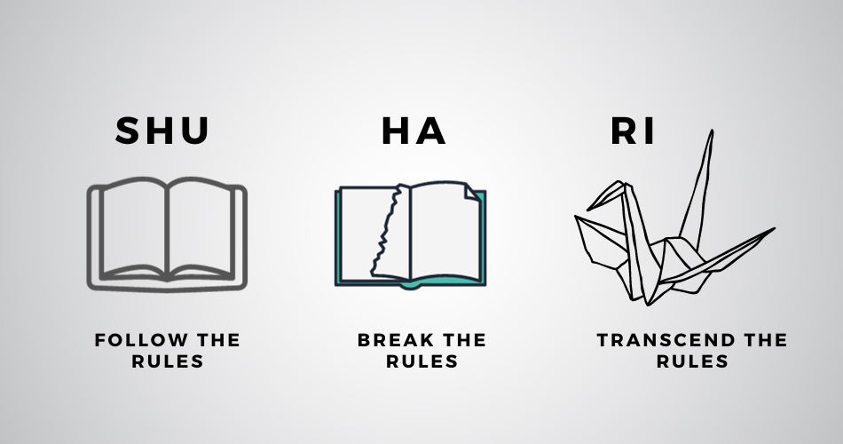
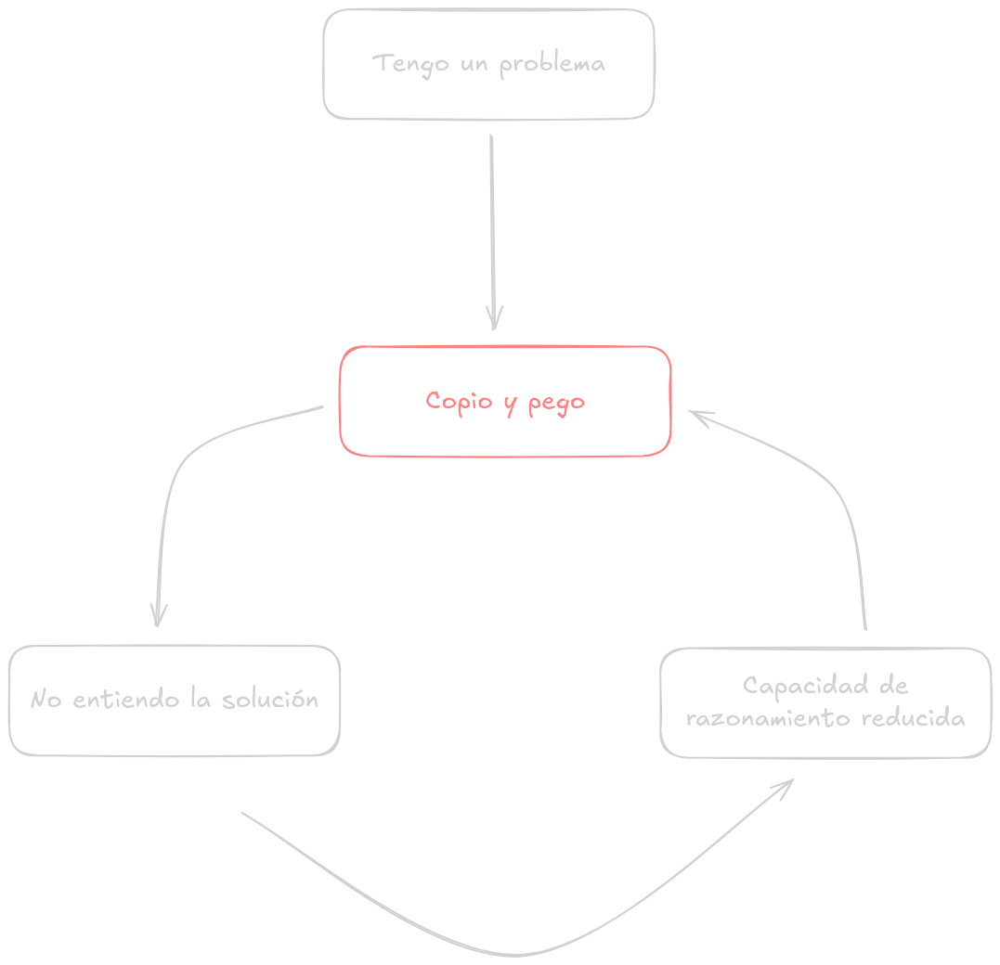
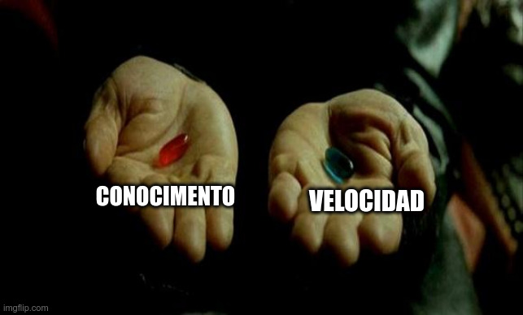
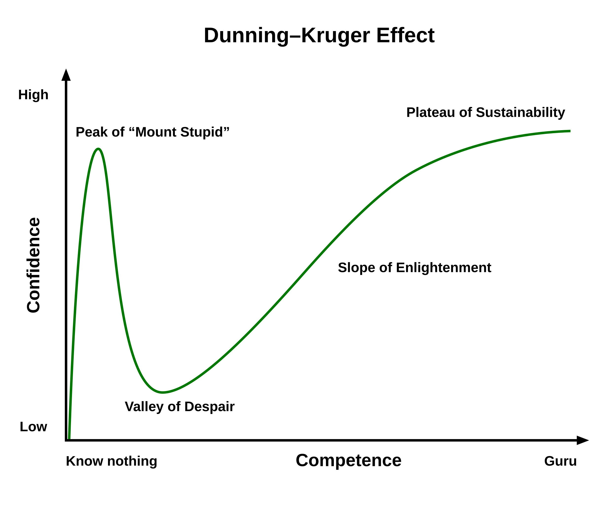

# Los peligros del "black box" development

Cómo sobrevivir en la era de la IA

---
class: 'center'
---

# Cultivando la intuición

---
class: 'center col'
---

> _"Lo que tenemos que aprender a hacer, lo aprendemos haciéndolo."_  
> <cite>— Aristóteles</cite>

Aprender = observar → imitar → crear

---
class: 'text-center'
---

## Shu-Ha-Ri

### Las etapas del aprendizaje hasta alcanzar la maestría.

---
class: 'center'
---

# El riesgo de no preguntar

---
class: 'v-center'
---

### El riesgo de no preguntar
<ul class="list">
  <li>Disminución de la capacidad para resolver problemas</li>
  <li v-click="1">Disminución de la confianza en uno mismo</li>
  <li v-click="2">Disminución de la función cognitiva</li>
</ul>

---
class: 'center'
---

# El rol del desarrollador

---
class: 'center col'
---

Programar ≠ escribir código

  
Programar = conocer, razonar, diseñar, resolver

  
❓ → 🧠 → 🔎 → 💡 → ⌨️  → ✅

---
class: 'center'
---

# Fast food code

---

Al copiar y pegar nos salteamos la parte más importante y valiosa del proceso.

❓ → 🍔 → ⌨️  → ✅

---
class: 'center'
---

Investigar + entender + dedicar tiempo = recompensa a largo plazo

---
class: 'center'
---

---
class: 'center'
---

# Volviendo a los fundamentos

---
class: 'v-center'
---

### Volviendo a los fundamentos
<ul class="list">
  <li>Practicar los básicos</li>
  <li v-click="1">Entrenar la "memoria muscular"</li>
  <li v-click="2">Conocer nuestras herramientas</li>
  <li v-click="3">Desarrollar la intuición</li>
</ul>

---
class: 'center'
---

# Trazando el mapa

---
class: 'v-center'
---

### El plan
<ul class="list">
  <li v-click="1">Idear una estrategia</li>
  <li v-click="2">Cada línea de código es un pasivo</li>
  <li v-click="3">Ser dueños de nuestro código</li>
</ul>

---
class: 'center'
---

# Las herramientas

---
class: 'v-center'
---

### Las herramientas
<ul class="list">
  <li>Conocimento técnico</li>
  <li v-click="1">Lenguajes</li>
  <li v-click="2">Librerías</li>
  <li v-click="3">Frameworks</li>
</ul>

---
class: 'center'
---

# El efecto Dunning-Kruger

---
class: 'v-center'
---

## El efecto Dunning-Kruger

<h4 v-click="1">Como evitar caer en esto ?</h4>

<ul>
  <li v-click="2">Mantener la curiosidad</li>
  <li v-click="3">Preguntar</li>
  <li v-click="4">Cuestionarnos a nosotros mismos</li>
  <li v-click="5">Implementar desde 0</li>
</ul>

---
class: 'center'
---

# La verdadera recompensa

---
class: 'v-center'
---

### La verdadera recompensa
<ul class="list">
  <li>Descubrimos que nada es magia</li>
  <li v-click="1">Difícil → Lógico, sencillo, fácil</li>
  <li v-click="2">Todo funciona igual. Distinta forma</li>
</ul>

---
class: 'v-center'
---

Al dominar nuestras herramientas:
<ul class="list">
  <li v-click="1">Menos bloqueos</li>
  <li v-click="2">Mayor productividad</li>
  <li v-click="3">Autosuficiencia</li>
</ul>

---
class: 'center'
---

# El entorno como aliado

---
class: 'v-center'
---

### El entorno como aliado
<ul class="list">
  <li>Velocidad</li>
  <li v-click="1">Menor carga mental</li>
  <li v-click="2">Mayor concentración</li>
  <li v-click="3">Hacer menos y mejor</li>
</ul>

---
class: 'center'
---

# Implementando desde 0

---
class: 'center'
---

# Software craftmanship

---
class: 'v-center'
---

### Software craftmanship

<ul class="list">
  <li v-click="1">No se trata de paser de rojo a verde</li>
  <li v-click="2">Conocimento profundo sobre lo que estamos haciendo</li>
  <li v-click="3">Calidad, armonía</li>
  <li v-click="4">Disfrutar de lo que hacemos</li>
  <li v-click="5">Ser responsables</li>
  <li v-click="6">Ser más competentes</li>
</ul>
